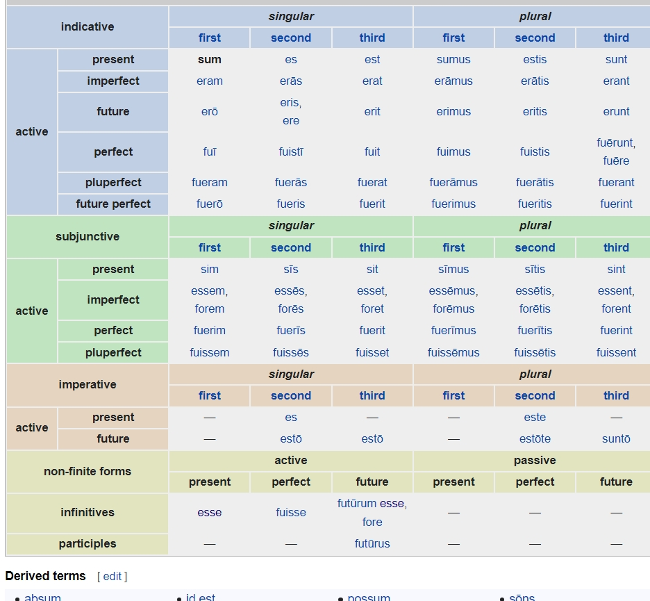
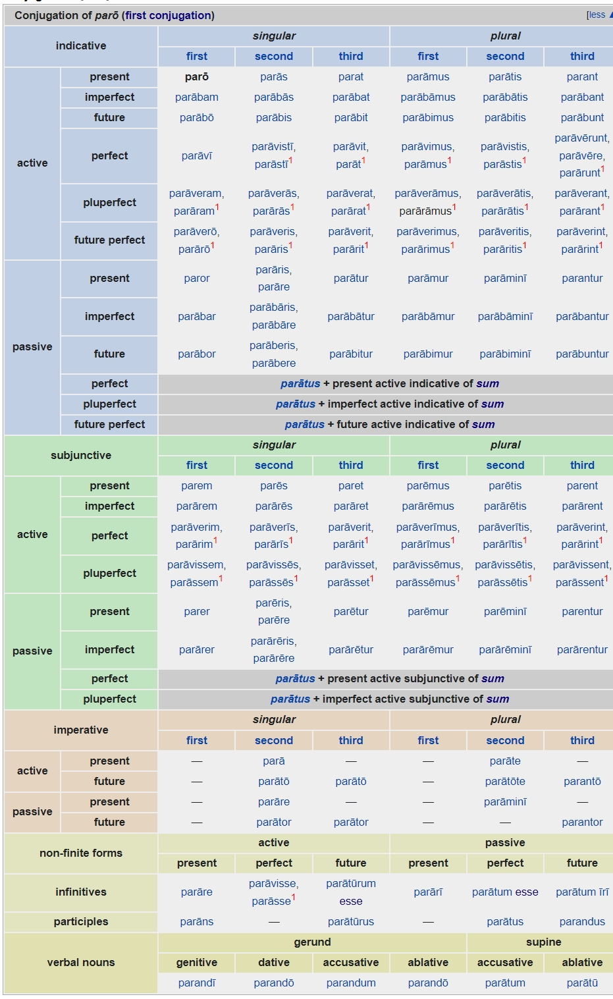
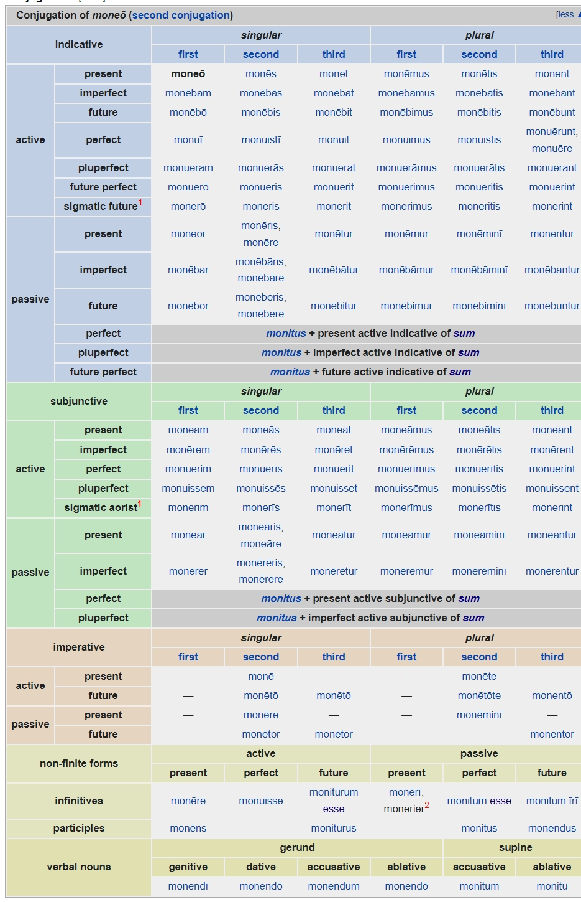
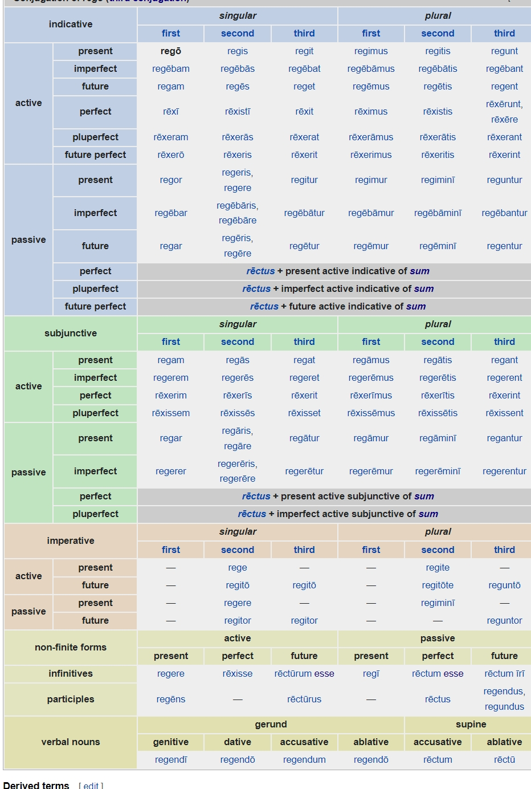
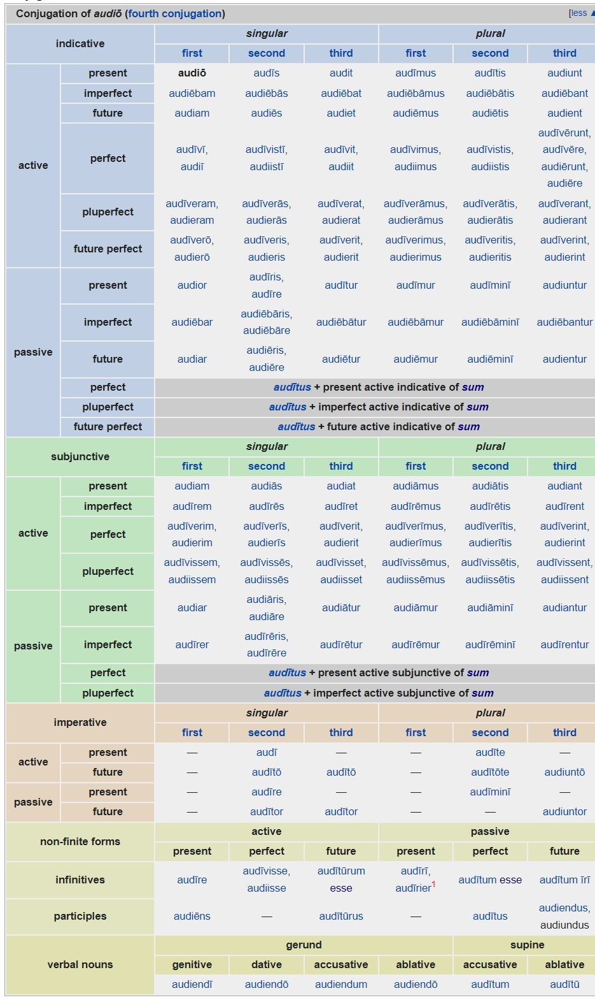
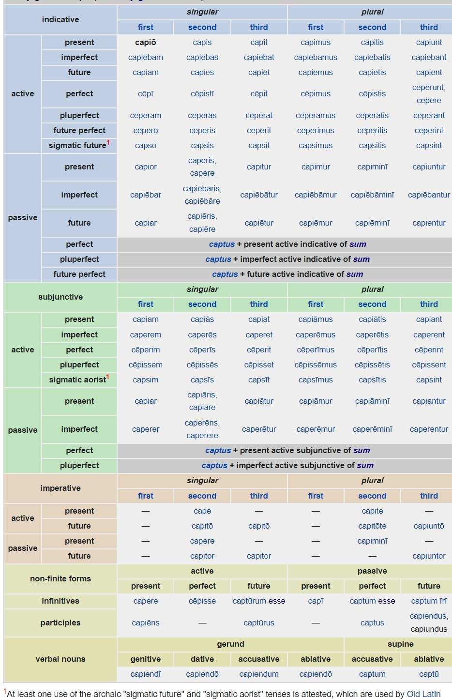

  * [Verbs](#verbs)
    * [The six tenses](#the-six-tenses)
    * [The irregular conjugation of *sum*](#the-irregular-conjugation-of-*sum*)
    * [1st conjugation-stems in *-a*](#1st-conjugation-stems-in-*-a*)
    * [2nd conjugation-stems in *-e*](#2nd-conjugation-stems-in-*-e*)
    * [3rd conjugation-stems in consonants](#3rd-conjugation-stems-in-consonants)
    * [4th conjugation-stems in *-i*](#4th-conjugation-stems-in-*-i*)
    * [Mixed conjugation-3rd conjugation verbs ending in *-іō*](#mixed-conjugation-3rd-conjugation-verbs-ending-in-*-іō*)

### Verbs

See [Latin Conjugation](https://en.wikipedia.org/wiki/Latin_conjugation)

#### The six tenses

- The *infectum* tenses
    - present: *dūcō* "I lead, I am leading"
    - future: *dūcam* "I will lead, I will be leading"
    - imperfect: *dūcēbam* "I was leading, I used to lead"
- The *perfectum* tenses
    - perfect: *dūxī* "I led, I have led"
    - future perfect: *dūxerō* "I will have lead"
    - pluperfect: *dūxeram* "I had led"

#### The irregular conjugation of *sum*

#### 1st conjugation-stems in *-a*

#### 2nd conjugation-stems in *-e*

#### 3rd conjugation-stems in consonants

#### 4th conjugation-stems in *-i*

#### Mixed conjugation-3rd conjugation verbs ending in *-іō*

//TODO
